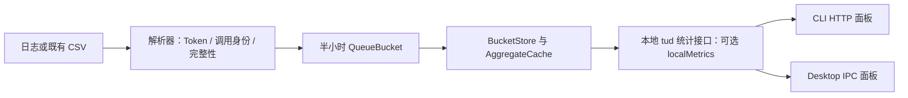

# 本地请求数与缓存统计设计

## 1. 背景与问题

- 需求来源：[Issue #66](https://github.com/juejin-cn/juejin-usage/issues/66)。用户希望在用量概览中查看总请求数、缓存读取量、缓存创建量和缓存命中率。
- 本方案编写于 2026-09-08，并随实现更新。本期只支持 CLI 托管的本地面板和 Desktop，不改线上 Web 服务。
- Core 的 `QueueBucket` 已保存普通输入、输出、缓存读取、缓存创建、推理输出和 `conversation_count`，但现有计数口径不能统一解释为请求数。
- Claude 对同一消息的流式更新只增加 Token，不重复增加 `conversation_count`；OpenCode 每次产生 Token 增量都会增加该字段；Copilot 使用会话结束时的模型汇总。直接展示这些字段的总和会混用不同单位。
- 当前 Dashboard 日统计的输入、输出、缓存拆分来自示例比例；小时接口的 `inputTokens` 来自普通输入，前端却把它当作包含缓存的输入并再次减缓存。新增指标需要同时消除本地链路中的这两处口径问题。

现状依据：[数据类型](../packages/core/src/types.ts)、[Claude 解析](../packages/core/src/parsers/claude.ts)、[OpenCode 解析](../packages/core/src/parsers/opencode.ts)、[Copilot 解析](../packages/core/src/parsers/copilot.ts)、[本地聚合](../packages/core/src/aggregate.ts)、[面板数据转换](../packages/dashboard/src/lib/dashboard-data.ts)。

## 2. 范围与影响面

| 范围 | 本期内容 |
| --- | --- |
| CLI 本地面板 | 通过现有 HTTP `/functions/tud-*` 读取新增统计，支持当前日期范围和工具筛选 |
| Desktop | 经现有 IPC 调用同一份内存 Hono API，同步实现 renderer 副本 |
| Core 采集 | 新增独立请求计数及数据完整性信息，缓存继续使用已有 Token 字段 |
| Core 存储、聚合 | 扩展半小时桶、增量合并、封存日缓存和本地查询返回值 |
| 本地 UI | 新增请求数、缓存读取、缓存创建、缓存命中率；本地输入输出和缓存趋势使用真实汇总 |
| 线上相关 | 不改公开 API、上传 payload、上传字段哈希、鉴权、云端存储、排行榜，不部署线上 Web |

- 复用当前“今天 / 7D / 30D / 90D”、工具多选和热力图日期下钻。本期不新增模型筛选控件、请求日志详情页、代理服务、成功率、延迟或失败重试统计。
- 请求计数首批适配 Claude（含 Desktop transcript）、Codex、OpenCode、Cursor；各格式的适用条件见第 5 节。其他采集器保留现有 Token/费用展示，未完成调用语义验证时显示请求数不可用，不推算。
- 缓存统计按采集器和数据格式的实际能力开放；不能因为工具支持 Token 统计，就假设它能完整报告缓存读写。
- “本地”指本机已采集数据和本地展示。Cursor 继续使用既有 CSV 获取方式，本期不增加网络采集渠道，也不关闭用户原有同步设置。

| 主要文件 | 预期修改 |
| --- | --- |
| `packages/core/src/types.ts`、`parsers/*.ts` | 本地指标类型、请求身份、完整性标记 |
| `parsers/shared.ts`、`sync/index.ts`、`queue/align-unknown.ts` | 指标合并、变更比较、模型归并和归零 |
| `queue/index.ts`、`server/state.ts` | 持久化、扩窗回填的幂等处理、内存更新 |
| `aggregate.ts`、`aggregate-cache.ts`、`server/local-api.ts` | 原始量聚合、本地响应、封存缓存升级 |
| 两端 `lib/api.ts`、`dashboard-data.ts`、`usage-filter.ts` | 可选本地契约、真实数据转换、按工具精确筛选 |
| 两端 `hooks/useDashboardData.ts`、`lib/usage-dataset-fingerprint.ts` | 完整/精简刷新、指标变化触发更新 |
| 两端 `components/DashboardOverviewCard.tsx`、趋势组件、`pages/DashboardPage.tsx` | 实际在用的概览入口、状态和图表展示 |

修改 `packages/dashboard/src` 时逐项核对 `apps/desktop/src/renderer` 的同名副本。当前页面使用 `DashboardOverviewCard`，不能只改旧的 `DashboardMetricCards`。

## 3. 总体方案



- 新请求数与 `conversation_count` 分离，不改变后者及其上传语义。现有 Token 字段继续作为唯一 Token 数据源，不再保存一份重复的缓存总量。
- 本地响应在旧字段之外新增可选 `localMetrics`，日数据补充按来源的精确切片。复用现有接口和 IPC，不新增服务或端口。
- 聚合器只累加原始量，最后计算缓存命中率。所有筛选先作用于相同的行集合，再生成概览和趋势，禁止按工具 Token 占比拆分请求数或缓存量。
- UI 仅在本地模式消费新增契约。Dashboard 的 `VITE_API_TARGET=server` 路径保持现有行为，不向线上发起新增查询。
- 缺失值和真实零值分开表达。部分数据无法统计时，不把已知部分标为完整的“总请求数”或“缓存命中率”。

## 4. UI 设计

- 入口为现有本地用量页，不增加新菜单或设置开关。
- 保留当前四个概览卡片，在它们下方、热力图上方增加一排四项统计。桌面宽度四列，中等宽度两列，窄屏一列；复用现有 HeroUI Card 和数值格式。

```text
日期范围 / 工具筛选

预估费用       总 Token        输入 Token       输出 Token
请求数         缓存读取        缓存创建         缓存命中率

活动热力图
Token 趋势 / 用量趋势 / 工具与项目分布
```

| 指标 | 展示与说明 |
| --- | --- |
| 请求数 | 完整时显示整数；说明“日志中可识别且包含用量的模型调用次数，同一调用的流式更新只计一次” |
| 缓存读取 | 展示缓存复用的 Token，支持缩写和完整数字 |
| 缓存创建 | 展示写入缓存的 Token，采用与读取相同的格式 |
| 缓存命中率 | 显示一位小数的百分比；说明“缓存读取 Token 占全部输入 Token 的比例”，附公式 |

- 输入 Token = 普通输入 + 缓存读取 + 缓存创建。输出 Token = 普通输出 + 推理输出；提示中说明包含推理，以便与总 Token 对账。缓存读写是输入的组成部分，不能在概览相加时再次计入总量。
- 某个输入分量不可用时，依赖它的输入总量也显示 `—`；独立保存的总 Token 和费用仍按原字段展示，不能把 `null` 当作零补齐。
- 本地 Token 构成趋势展示普通输入、缓存创建、缓存读取、输出（含推理），直接使用同一套真实原始量。指标缺失时对应曲线留空，不填示例比例；总 Token/费用仍可展示。
- 本期新增四项不增加环比、小折线或请求数专用图表，减少首版信息密度；已有概览和趋势的数据口径必须一致。
- 时间范围、工具筛选、日期下钻同时影响概览中的所有数字。热力图保留完整日期导航，工具筛选作用于它的每日数值，不因单日下钻丢失其他日期。

| 状态 | 表现 |
| --- | --- |
| 已完成采集，范围内无用量 | 请求数、各 Token 显示 `0`；缓存命中率显示 `—`，说明“暂无输入 Token” |
| 完整数据，输入大于 0、缓存读取为 0 | 缓存命中率显示 `0.0%` |
| 请求数部分缺失 | 主值 `—`，标注“请求数据不完整”；说明中可显示“已记录 N 次，另有历史或来源数据缺失” |
| 缓存某一项缺失 | 缺失项和依赖它的命中率显示 `—`；独立且完整的其他项照常显示 |
| 旧本地 API 没有新契约 | 原有页面正常工作；本地新增区显示“当前本地服务版本暂不提供此统计” |
| 首次加载 / 刷新 / 采集失败 | 复用加载骨架和状态提示；失败不转换成空集合或 `0`，保留最后一次成功结果并标明未更新 |

说明通过可聚焦的提示入口展示，不能仅依靠鼠标悬停或颜色区分。CLI 与 Desktop 文案、空态和数字保持一致。

## 5. 核心模型与接口契约

### 5.1 指标口径

设 `U` 为普通输入，`R` 为缓存读取，`W` 为缓存创建，`O` 为普通输出，`Q` 为推理输出：

```text
全部输入 = U + R + W
全部输出 = O + Q
缓存命中率 = R / (U + R + W)
```

- 对规范化后互斥的 Token 字段使用该公式；OpenAI 风格原始输入中已包含的缓存，只在解析层扣除一次。
- 跨小时、跨天、跨工具先分别汇总 U/R/W，再计算比例；不能平均各行的命中率。分母为 0 时返回 `null`。
- 有数据缺失或无法验证口径时，不通过截断到 100%、裁剪缓存量等方式制造可用结果。
- 请求单位为一条可识别的模型调用用量。用户发言、工具执行、会话、半小时桶、上传事件均不是请求单位。未留下用量的失败、取消和网络重试不在本期可保证覆盖的范围内。

### 5.2 桶与解析结果

在 `TokenTotals` 和 `QueueBucket` 上增加可选元数据（下述为拟新增类型）：

```ts
interface LocalMetricEvidence {
  version: 1;
  requestCount: number;       // 该增量/桶中已确认的调用数，非负整数
  requestCountComplete: boolean;
  cacheReadComplete: boolean;
  cacheWriteComplete: boolean;
  missingReasons: Array<
    'legacy_data' | 'unsupported_source' | 'missing_fields' |
    'ambiguous_request' | 'invalid_usage'
  >;
}

// TokenTotals / QueueBucket 新增：local_metrics?: LocalMetricEvidence
```

- `requestCount=0` 且 complete 为 true，表示确认没有新调用，例如同一请求的后续流式用量；false 表示无法给出完整计数。
- “字段不存在”只有在该采集格式明确规定其等价于零时，才能视为完整的零。解析器用 `?? 0` 得出的数字本身不构成完整性证据。
- 缓存完整性还要求普通输入口径已确认且未使用估算值。输入未知或重复包含缓存时相应 complete 必须为 false，不能仅凭 R/W 有数值就计算命中率。
- 两个增量合并：已知请求数相加，完整性逐项取 AND，原因去重合并。已有旧桶缺少元数据时按未知参与合并，不能因新增一笔完整增量把整个桶变成完整。
- 桶首次创建时没有历史项，不引入一次虚假的“未知”合并。替换型采集器写完整快照时按快照覆盖，不能套用增量相加。
- 模型归并要同时移动请求数及完整性；撤回/归零旧桶时清零请求数并移除旧缺失影响，空的撤回桶不参与覆盖判断。
- 请求身份和已计数状态保存在本地游标；仅保留去重所需信息，不持久化提示词、响应正文或额外凭据。

### 5.3 首批请求计数适配

以下是实现规则，不代表当前所有格式已通过验证。实现时为每条规则建立最小日志样本；证据不足的记录必须降级。

| 来源 | 计数规则 | 必须处理的边界 |
| --- | --- | --- |
| Claude CLI / Desktop | 使用消息 ID 与 requestId 构成的调用身份；第一次可计费用量计 1，后续更新计 0 | 同消息多个内容块、重复日志、子会话、缺少稳定身份；沿用并核对现有去重逻辑 |
| Codex | 可确认对应单次调用的 `last_token_usage` 计 1，并结合会话、事件顺序及累计用量识别重复通知 | 相同累计用量的重复通知、fork 历史重放、模型切换、累计计数重置；仅有一次累计总量且无法还原调用次数时不计作 1 |
| OpenCode | `sessionId + messageId` 第一次出现有效用量计 1；同消息 SQLite/JSON 更新计 0 | SQLite 与旧 JSON 双路径、消息改写、跨轮增量和缺失 ID |
| Cursor | 既有 CSV 中确认代表单次用量的记录计 1；每次抓取生成范围快照并替换 | 重复抓取、同时间合法多条记录、模型修正、快照撤回；不以整行内容相同直接删除合法请求 |
| 其他来源 | 当前轮先标记未支持请求数；以后逐采集器按同一契约加入 | 会话累计、估算 Token、无稳定请求边界不能用 `conversation_count` 代替 |

- 相同 Token 数的两次独立调用仍是两次，不能仅用 Token 向量去重；仅按时间戳去重也不足以证明调用身份。
- 请求归属到首次有效用量的半小时桶，后续同一请求的 Token 增量可以继续写入其原有用量时间桶，但不能再增加请求数。
- 去重状态必须覆盖日志仍可能被重读的区间；不能仅依赖一个任意大小、会淘汰旧身份的全局集合。正常增量、重启恢复、截断后重读和扩窗回放要分别验证。

### 5.4 本地查询返回值

本地接口保持 `{ success, message, data }` 包装及旧字段，新增可选属性。线上不要求新增属性。

```ts
interface LocalUsageMetrics {
  version: 1;
  uncachedInputTokens: number;
  cacheReadTokens: number | null;
  cacheWriteTokens: number | null;
  outputTokens: number;             // 不含推理
  reasoningOutputTokens: number;
  requestCount: number | null;      // 仅完整覆盖时提供
  knownRequestCount: number;        // 仅用于缺失说明，不替代总请求数
  cacheHitRate: number | null;      // [0, 1]，展示时格式化为百分比
  missingReasons: LocalMetricEvidence['missingReasons'];
}
```

| 本地响应位置 | 新增字段 |
| --- | --- |
| `tud-usage-summary` 及 account 别名 | `localMetrics`、`todayLocalMetrics`，各来源/模型行的 `localMetrics` |
| `tud-usage-daily` 每日行 | `localMetrics`，以及 `sources?: { source, tokens, costUsd, localMetrics }[]` |
| `tud-usage-hourly` 每小时/来源行 | `localMetrics`；保留旧 `inputTokens` 等字段原义 |
| `tud-usage-model-breakdown` 模型/项目切片 | 可选 `localMetrics`，便于本地各视图按相同口径核对 |

- Core 可提取共享聚合辅助函数；从直接聚合和 `AggregateCache` 两条路径返回相同内容。
- 数字已知且为 0 时返回 0；不完整时对应指标返回 `null`。原因只反映所选范围内实际参与统计的数据，不能因为安装了一个未使用的不支持工具就把总数标为缺失。
- 返回的日来源切片包含真实 Token/费用和新指标，前端按来源相加生成本地概览。请求数、缓存构成和命中率不经过现有按比例分摊的 `usage-filter` 分支。
- 费用继续使用现有定价和 `reported_cost_usd` 规则；本期不新增“缓存节省金额”，避免引入另一套计费假设。
- 桌面继续使用 `tud:api-request` 和 `tud:data-synced`，无需新增 IPC channel。

## 6. 关键流程

### 6.1 采集与刷新

- runtime owner 通过现有串行 sync runner 读取数据，解析器同时产出 Token 增量和本地指标元数据。observer 只读取落盘结果，不独立增加请求数。
- `sumTokenTotals`、`bucketsFromState`、`mergeBuckets`、模型归并和 Cursor 快照替换必须完整保留新字段。
- `bucketChanged` 比较新增字段及各 Token 分量，不能只比较总 Token 和 `conversation_count`；仅请求数、缓存分类或完整性变化也必须落盘。
- 按现有桶键追加最新完整快照，再通过 `BucketStore.apply` 更新内存；查询和重启加载继续取每个桶键的最后一行，不把 append-only 文件的所有版本累加。
- 更新被影响日期的封存聚合，触发原有本地数据刷新。UI 指纹纳入新增指标和日来源切片，不能因总 Token 不变而跳过更新。
- 精简刷新只能复用未变化的日数据；请求修正、历史桶更新或完整性变化时，使对应日缓存失效并重新获取。快速切换日期/工具要避免旧请求覆盖新筛选结果。
- 页面未取得新字段时使用明确的不可用状态；显式 mock 开关下才允许样本数据。本地真实数据转换不得进入 `normalizeDailyRow` 的示例比例分支。

### 6.2 时间范围扩展

实现基于上游 `b3adb4a`：现有 `ensureLocalCollectRange` 清空游标后，sync 已能识别全量解析并按来源替换桶，避免与已有桶重复叠加。

- 复用现有扩窗/全量快照机制，不新增第二套临时回填游标或范围提交协议。请求数与 Token 一起随快照替换。
- 正常增量继续按桶相加；Cursor 继续使用既有范围快照替换及撤回归零。
- 回填与正常同步继续由同一 owner 串行协调。新增测试验证重扫、扩大范围后继续增量、重复同步的请求数保持幂等。
- 本期不自动清空 queue 或重建全部历史请求数。旧桶缺少证据时保持未知。

### 6.3 实施顺序

- 第一步：实现指标模型、合并/撤回规则及首批解析器计数；先验证重复扫描、流式更新和重放不增加请求数。
- 第二步：验证既有扩窗快照边界、本地聚合、封存缓存升级和 API 可选字段，验证启用和禁用封存缓存时的 API 结果一致。
- 第三步：同步修改两端数据转换、筛选、刷新指纹、概览卡片与 Token 构成趋势。
- 第四步：用隔离的数据目录验证升级、重启和 HTTP/IPC 一致性，再做两端 UI 检查与构建；用户可见实现另附 changeset。本设计稿本身不需要 changeset。

## 7. 兼容、迁移与降级

- Queue JSONL 采用可选字段扩展，桶键保持不变，不重命名或复用 `conversation_count`。`IngestBucket` / `IngestEventPayload` 继续显式挑选原字段，不透传 `local_metrics`。
- `aggregateForIngest` 和上传 `bucketHash` 不纳入本地指标；单独补充请求元数据不得导致上传 payload 或上传哈希变化。
- 旧桶的请求次数无法仅凭已聚合 Token 可靠还原，缺少新元数据时默认未知。新旧数据同处一桶时保持不完整；新建且完整采集的桶可正常显示请求数。
- 历史缓存字段仍保留。仅对能从已验证采集格式确认读写语义、且缺字段约定明确的旧桶启用历史缓存统计；没有足够证据的旧桶标记 `legacy_data`，不能把历史补零当成真实未命中。该兼容判断集中在 Core，不能由前端猜测。
- 本期不自动调用 `resetLocalUsageCache`、清空 queue 或强制全量重采集，也不新增历史重建按钮。已有原始数据保留；历史完整请求回填可后续单独设计，不阻塞新的本地统计。
- `AggregateCache` 当前封存版本为 3；新增本地切片后提升版本并从现有 queue 重建派生缓存。该操作不改源队列或采集游标；缓存中必须保留缺失状态和按来源切片。
- 新 UI 对旧 Core 缺字段兼容；旧 UI 忽略新字段。旧 Core 可能在重写桶时丢弃新元数据，之后新版本将其按未知处理，不能假设降级期间仍连续计数。
- 日历统计继续使用项目既有时区工具和范围解析。半小时存储精度保持不变，不能声称具备请求级精确时间筛选。
- 数据完整性表示“已采集记录可按此口径统计”，不等于证明本机所有调用均被捕获。采集失败/未就绪使用原有 sync 状态提示，不能仅凭空桶宣布统计完成。

## 8. 验收标准与验证方式

| 验收项 | 预期结果 |
| --- | --- |
| 公式对账 | U=100、R=600、W=300、O=80、Q=20：全部输入 1000，全部输出 100，总 Token 1100，命中率 60.0% |
| 加权汇总 | 两组输入分别 100、900，读取分别 90、90：汇总命中率 18.0%，不能取两组百分比平均得到 50.0% |
| 真实零与缺失 | 完整输入大于 0 且读取为 0 时显示 0.0%；无输入显示 `—`；不支持/历史缺失显示 `—` 并说明原因 |
| 单次请求 | 同一个有效调用的多条内容块、流式更新、同消息改写只计 1；两个身份不同且 Token 相同的调用计 2 |
| Codex 特例 | 同累计值重复通知、fork 重放不重复计数；只有累计快照无法判断次数时显示缺失 |
| 增量恢复 | 同步两次、重启再次同步、日志截断重读，不重复叠加已确认的请求 |
| 扩大范围 | 今天 → 7D → 30D → 90D，已有重叠区间的请求/Token 不增加；回填失败重试不重复写增量 |
| 快照与模型归并 | Cursor 同快照重复刷新不变；撤回桶不残留请求数；模型归并前后总请求数守恒 |
| 只修改新指标 | 总 Token 不变、请求数/缓存分量/完整性变化时，存储、封存缓存和 UI 均更新 |
| 范围与工具 | 概览、缓存构成趋势、日期下钻使用同一时间和来源集合，无按比例推算；取消工具筛选恢复正确总量 |
| 兼容升级 | 旧 queue 保留，缺失状态可见；派生缓存重建不改变原 Token、费用和上传哈希 |
| 两端一致 | 同一 queue、日期范围和工具条件下，CLI HTTP 与 Desktop IPC 的新指标完全一致 |
| 本地边界 | 本地断开云端仍能查看已采集数据；server 模式不显示本地新增区、不增加线上接口依赖 |

- 新增测试文件、测试用例标题、fixture 和临时目录统一使用 `pika` 前缀，例如 `pika-local-usage-metrics.test.ts`、`pika-request-stream.jsonl`；不重命名无关既有测试。
- Core 验证覆盖解析、合并/撤回、直接聚合与封存聚合、本地 API、扩窗回填和上传字段隔离。前端验证真实日/小时转换、来源筛选、缺失状态和刷新指纹；新增文件须加入各 package 实际测试脚本。
- 实现完成后运行 `pnpm --filter @juejin-opensource/jusage-core test`、Dashboard/Desktop 各自的相关测试，并按根脚本运行 `pnpm build`。使用 CLI 托管面板验证时先 `pnpm build:cli`，确保检查的是最新 dist。
- UI 人工验证覆盖 CLI 和 Desktop 的正常数据、零用量、旧数据、混合来源、窄屏、键盘提示和快速切换筛选；使用隔离 fixture，不清理用户真实 `~/.ai-usage/`。
- 2026-09-08 实现验证：Core 287 项、Dashboard 70 项、Desktop 25 项主进程/更新测试与 4 项 renderer 指标测试全部通过；`pnpm build` 和 Desktop `typecheck` 通过。自动测试使用 Node 26，生产构建使用 Node 20。
- 使用隔离 fixture 验证 CLI 的渠道筛选、今日/空日下钻和键盘提示；使用实际 Desktop preload + Hono IPC 的隔离 Electron 窗口验证统计展示、数据更新与 390px 单列布局。截图见 [正常概览](images/pika-local-usage-desktop.png) 和 [历史数据缺失](images/pika-local-usage-legacy.png)。
- Claude/Codex 的已识别调用身份保留到游标重置，避免任意条数淘汰导致重读重计；游标体积随已采集调用数量增长。本期不新增历史数据重建或游标压缩机制。
